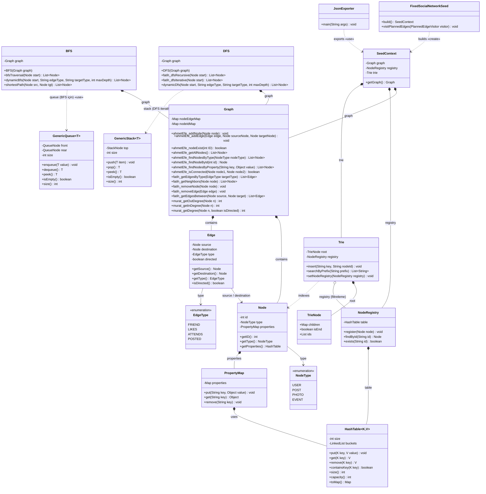

# Property Graph Tabanlı Sosyal Ağ Modelleme 🌐


**Property Graph Network**, kullanıcılar, gönderiler ve etkinlikler arasındaki karmaşık ilişkileri yönlü bir çizge (graph) yapısı üzerinde bellek içi (in-memory) modelleyen, yüksek performanslı bir sosyal ağ simülasyon API'sidir.

**Projemiz baştan aşağı Dockerize edilmiş olup, sıfır konfigürasyon (Zero-Config) mantığıyla tek tıkla her ortamda çalışmaya hazırdır.**

## Neden Bu Sistemi Kullanmalısınız? (When to use)

Geleneksel ilişkisel veri tabanları (RDBMS), derinlemesine ilişkileri sorgularken ağır `JOIN` işlemleri nedeniyle performans kaybeder. Bu proje, "Property Graph" mantığını sıfırdan uygulayarak bu engeli aşar:
* **%100 Dockerize Mimari:** Lokal bilgisayarınıza Java, Node.js veya herhangi bir SDK kurmanıza gerek kalmadan tüm sistem izolasyonlu konteynerlerde çalışır.
* **Çok Adımlı Sorgular:** A -> B -> C şeklindeki ilişkisel patikalar $O(V+E)$ sürede taranır.
* **Hızlı Düğüm Erişimi:** Hash Table altyapısı sayesinde herhangi bir düğümün detaylarına $O(1)$ sürede ulaşılır.
* **Akıllı Arama (Autocomplete):** Trie (Önek Ağacı) entegrasyonu ile metin tabanlı aramalar anında sonuç verir.
* **Tamamen Bellek İçi (In-Memory):** Dış bir veri tabanına ihtiyaç duymaz, seed (tohum) verisiyle saniyeler içinde kendi kendini ayağa kaldırır.

### Teknoloji Karşılaştırması

| Özellik | Geleneksel RDBMS | Bizim Property Graph |
| :--- | :--- | :--- |
| **İlişki Takibi (Traversal)** | Ağır ve yavaş (JOIN'ler) | Hızlı (Adjacency List) |
| **Bağlantı Arama (Shortest Path)** | Desteklenmez / Çok zor | Yerleşik BFS Algoritması |
| **Metin Tamamlama** | LIKE '%...' (Yavaş) | Trie (Karakter bazlı, $O(m)$) |
| **Altyapı İhtiyacı** | Harici Sunucu Gerekli | 0 Bağımlılık (In-Memory) |

---

## Proje Klasör Yapısı (Directory Structure)

Sürdürülebilirliği sağlamak adına tüm modüller ve özel veri yapıları "Clean Architecture" prensiplerine uygun olarak paketlenmiştir.

```text
veri-yapilari-grup-projesi/
├── backend/                         # Spring Boot API Modülü
│   ├── src/main/java/.../socialnetwork/
│   │   ├── configuration/           # CORS ve AppBeans (Sistem Ayarları)
│   │   ├── controller/              # REST API Uç Noktaları (GraphFilter, ChainQuery vb.)
│   │   ├── datastructures/          # Custom Veri Yapıları (Graph, Trie, HashTable, Queue, Stack)
│   │   ├── model/                   # Çekirdek Sınıflar (Node, Edge, PropertyMap)
│   │   ├── seed/                    # Sentetik Veri Üretimi ve Bootstrapping (SeedContext)
│   │   └── service/                 # İş Mantığı (Filtreleme, BFS/DFS, Arama Servisleri)
│   ├── src/test/                    # Kapsamlı Unit Test Sınıfları
│   └── Dockerfile                   # Backend Konteyner Yapılandırması
│
├── frontend/                        # React & Vite Kullanıcı Arayüzü (Cytoscape Entegreli)
│   ├── src/                         # Arayüz Bileşenleri
│   ├── Dockerfile                   # Frontend Konteyner Yapılandırması
│   └── package.json                 # Node.js Bağımlılıkları
│
└── docker-compose.yml               # Tüm Sistemi Tek Tıkla Ayağa Kaldıran Config Dosyası
```

---
## Mimari Ve Veri Yapısı
### 🏗️ Sistem Sınıf (UML) Diyagramı

Sistemimizin temel veri yapıları ve servis mimarisi arasındaki ilişkiler aşağıdaki UML diyagramında gösterilmiştir:


## 📐 UML Sınıf Diyagramı

### `com.grup15.socialnetwork`




---

## 🚀 Kurulum ve Çalıştırma (Sıfır Konfigürasyon)

Projeyi bilgisayarınıza kurmanın en temiz ve tek yolu **Docker** kullanmaktır.
Arka plandaki tüm bağımlılıklar otomatik olarak çözülür.

```bash
# 1. Projeyi klonlayın
git clone https://github.com/csarptokatlayan/veri-yapilari-grup-projesi.git
cd veri-yapilari-grup-projesi

# 2. Tüm sistemi (Backend + Frontend) arka planda tek tıkla ayağa kaldırın
docker-compose up -d
```

> **Not:** `docker` ve `docker-compose` yüklü olduğundan emin olun.
> Kurulum için [Docker Docs](https://docs.docker.com/get-docker/) sayfasını ziyaret edebilirsiniz.
Konteynerler ayağa kalktıktan sonra sistem saniyeler içinde kullanıma hazırdır:
* **Frontend Arayüzü (Cytoscape):** `http://localhost:5173`
*  **Backend API:** `http://localhost:8080`

Sistemi durdurmak ve temizlemek için terminalde `docker-compose down` komutunu kullanabilirsiniz.

---

## REST API Kullanımı

Sistem, HTTP istekleri üzerinden esnek bir kullanım sunar.

**Basit Gezinme (Traversal):**
```http
GET /traversal/bfs/1
```
*(1 numaralı kullanıcıdan başlayarak ağı dalga dalga tarar ve `{ nodes, edges }` döner.)*

**Akıllı Zincirleme Sorgular (Recommendation Engine):**
```http
GET /chain/1/friends-likes
```
*(1 numaralı kullanıcının arkadaşlarını bulur ve onların beğendiği gönderileri filtreleyerek getirir.)*

**Düğüm ve İlişki Filtreleme:**
```http
# Sadece "User" tipindeki düğümleri getirir
GET /filter/node/type/USER

# Sadece "Yaşı 21 olanları" getirir
GET /filter/node/property?key=age&value=21

# Sadece "Beğeni" ilişkilerini getirir
GET /filter/edge/type/LIKES
```


## Performans Analizi ve Sistem Sınırları

Bu proje, yüksek performanslı okuma/arama (Read-Heavy) işlemleri için optimize edilmiştir. Sistemin bellek içi (in-memory) çalışması ve seçilen veri yapıları, geleneksel veri tabanlarına kıyasla belirli avantajlar ve sınırlar getirir.

### 1. Zaman Karmaşıklığı (Time Complexity) Optimizasyonları
* **Neden Adjacency List (Komşuluk Listesi)?** Sosyal ağlar yapıları gereği "seyrek" (sparse) graflardır. Matris (Adjacency Matrix) kullansaydık bellek karmaşıklığı gereksiz yere $O(V^2)$ olacaktı. Biz komşuluk listesi kullanarak hem uzay karmaşıklığını $O(V + E)$ seviyesine indirdik hem de bir düğümün komşularını bulma işlemini optimize ettik.
* **Hash Table ile O(1) Erişimi:** Graf içindeki düğümlerin detay özelliklerine (PropertyMap) erişim $O(1)$ sürede gerçekleşir. ID'si bilinen bir kullanıcıyı veya gönderiyi bulmak için tüm graf taranmaz.
* **Trie Algoritması:** Arama çubuğunda tüm veritabanını taramak yerine, Trie veri yapısı sayesinde arama hızı kelimenin uzunluğuna ($O(m)$) indirilmiştir.

### 2. Bellek Yönetimi ve Uzay Karmaşıklığı (Space Complexity)
* Sistemimiz dış bir veritabanı (PostgreSQL, Neo4j vb.) kullanmadığı için uygulamanın kapasitesi doğrudan **JVM Heap Size (RAM)** ile sınırlıdır.
* Oluşturulan nesneler (Düğümler ve Kenarlar) RAM üzerinde `ConcurrentHashMap` içerisinde tutulur. Milyonlarca düğüm (Node) içeren bir Seed datası yüklenmesi durumunda Java Garbage Collector (GC) darboğazları yaşanabilir. Bu nedenle simülasyon ortamında varsayılan olarak **küçük/orta ölçekli graflar (150-500 Node)** hedeflenmiştir.

### 3. Thread-Safety ve Eşzamanlılık (Concurrency)
* **Mikroservis ve Çoklu İstek (Multi-threading):** Backend API'miz aynı anda birden fazla kullanıcıdan istek alacak şekilde tasarlanmıştır.
* Graf üzerinde eşzamanlı okuma ve yazma işlemleri sırasında veri tutarsızlığı yaşanmaması için arka planda standart `HashMap` yerine **Thread-Safe** olan `ConcurrentHashMap` kullanılmıştır.

### 4. Frontend Render (Görselleştirme) Sınırları
* Çizge görselleştirmesi için kullanılan **Cytoscape.js**, HTML5 Canvas üzerinde binlerce nesneyi aynı anda render etmeye çalışırsa tarayıcıyı dondurabilir. Dinamik zincirleme sorgularda (Chain Queries) Canvas çökmelerini engellemek için API tarafında varsayılan bir `depth` (derinlik) limiti uygulanmıştır.

---

## Algoritmaların Zaman Karmaşıklığı (Big-O) Detaylı Analizi

Projemizde kullanılan veri yapıları ve algoritmaların performans sınırları, sistemin bellek içi (in-memory) doğasına uygun olarak optimize edilmiştir. Aşağıdaki analizlerde $V$ graf üzerindeki toplam düğüm (Vertex/Node) sayısını, $E$ ise toplam ilişki (Edge) sayısını temsil etmektedir.

| Algoritma / İşlem | Veri Yapısı | Zaman Karmaşıklığı |
| :--- | :--- | :--- |
| **Arama Çubuğu (Autocomplete)** | Trie | $O(m)$ |
| **Düğüm Detayı Getirme** | Hash Table | $O(1)$ |
| **BFS / DFS Gezinme** | Graph | $O(V + E)$ |
| **En Kısa Yol (Shortest Path)** | Graph | $O(V + E)$ |
| **Düğüm Özelliği Filtreleme** | Hash Table | $O(V)$ |
| **Düğüm Tipine Göre Filtreleme** | Graph | $O(V)$ |
| **İlişki (Edge) Tipine Göre Filtre** | Graph | $O(V + E)$ |

**1. Arama Çubuğu (Trie ile Autocomplete) - $O(m)$**
* **Açıklama:** Arayüzdeki arama kutusuna yazılan bir kelimeyi bulmak için tüm kullanıcıları taramak $O(N)$ vakit alacaktır. Bunun yerine karakter bazlı bir Trie (Önek Ağacı) inşa edilmiştir.
    * **Analiz:** Aranan kelimenin uzunluğuna $m$ dersek, ağaç üzerinde sadece kelimenin harfleri kadar derinliğe inilir. Grafın içinde 1 milyon düğüm bile olsa, 5 harfli bir kelime arandığında sadece 5 adımda $O(m)$ işlem yapılarak sonuçlar $O(1)$ sürede çekilmek üzere hazır hale getirilir.

**2. Düğüm Detaylarına Erişim (Hash Table) - $O(1)$**
* **Açıklama:** Düğümler (Kullanıcı, Etkinlik vb.) bellek üzerinde `ConcurrentHashMap` veri yapısında saklanır.
* **Analiz:** Bir düğümün ID'si biliniyorsa (örneğin arayüzde bir node'a tıklandığında), o düğümün yaş, isim, tip gibi özelliklerine erişmek için doğrusal arama yapılmaz. Hash fonksiyonu sayesinde veriye doğrudan ortalama $O(1)$ karmaşıklığıyla erişilir.

**3. Gezinme (BFS ve DFS) Algoritmaları - $O(V + E)$**
* **Açıklama:** Graf üzerindeki bir düğümden başlayarak diğer düğümlerin keşfedilmesi işlemidir.
* **Analiz:** Komşuluk listesi (Adjacency List) kullanıldığı için, bir gezinme işlemi sırasında her düğüm kuyruğa/yığına (Queue/Stack) en fazla bir kere eklenir (Ziyaret edildi - Visited kontrolü sayesinde). Ayrıca her düğümün sahip olduğu kenarlar da sadece bir kez kontrol edilir. Bu nedenle toplam işlem süresi düğüm ve kenar sayısının toplamı ile doğru orantılı olan $O(V + E)$ ile sınırlıdır.

**4. En Kısa Yol (Shortest Path) - $O(V + E)$**
* **Açıklama:** Ağırlıksız (unweighted) grafımızda iki düğüm arasındaki en kısa mesafe (degrees of separation) hesaplamasıdır.
* **Analiz:** İşlem, modifiye edilmiş bir BFS algoritması ile çalışır. Hedef düğüm bulunana kadar ağ dalga dalga taranır. En kötü senaryoda (hedef düğüm grafın diğer ucundaysa veya hiç bağlantı yoksa) tüm graf taranacağı için karmaşıklık $O(V + E)$ olur.

**5. Zincirleme Sorgular (Chain Queries) - $O(b^d)$ veya $O(\text{Adım} \times \text{Komşu})$**
* **Açıklama:** "Kullanıcının arkadaşlarının katıldığı etkinlikler" gibi kısıtlı ve yönlü patika analizleridir.
* **Analiz:** Bu işlem tüm grafı taramaz. Maksimum derinlik (depth) $d$, bir düğümün ortalama komşu sayısına (branching factor) $b$ denirse, algoritma sadece belirtilen adım sayısı kadar derine inip hedefleri bulur. İşlem hacmi genel graftan ziyade yerel komşuluk derecelerine bağlıdır.

**6. Dinamik Veri Filtreleme (Node & Property Filters) - $O(V)$**
* **Açıklama:** Belirli bir tipe (örn: sadece Event'ler) veya özelliğe sahip düğümleri getiren fonksiyondur.
* **Analiz:** Filtreleme işlemlerinde Hash Table içerisindeki tüm değerler (Values) bir kez tarandığı için $O(V)$ sürede çalışır. İçerideki kontrol mekanizması (eşitlik durumu) sabit $O(1)$ sürede gerçekleşir.

**7. İlişki (Edge) Filtreleme - $O(V + E)$**
* **Açıklama:** Sadece belirli tipteki ilişkilerin (örn: sadece FRIEND bağlantıları) filtrelenmesi işlemidir.
* **Analiz:** Komşuluk listesindeki her bir düğümün ($V$) sahip olduğu tüm kenarların ($E$) üzerinden geçilerek koşul kontrolü yapılır. Toplamda her kenara bir kez bakıldığı için zaman karmaşıklığı $O(V + E)$ olarak hesaplanır.

---

## Testleri Çalıştırma (Running Tests and Checks)

API uç noktalarının, veri yapılarının ve özel filtreleme servislerinin güvenilirliğini doğrulamak için `backend` dizininde birim testler (Unit Tests) bulunmaktadır.

```bash
cd backend

# Testleri JUnit ve Mockito ile çalıştırın:
mvn clean test
```
*Not: Pull Request açmadan önce testlerin başarılı (`exit code 0`) olduğundan emin olun.*

## 📹 Tanıtım Videosu

Projenin canlı demosu, veri yapılarının kod üzerinden anlatımı ve tüm sistemin çalışır hali aşağıdaki videoda gösterilmektedir:

🎬 **[Demo Videosunu İzle](https://youtu.be/g6GyrpIfNLk)**

---

## 📖 API Dokümantasyonu

Tüm endpoint'lerin detaylı açıklaması, istek/yanıt formatları ve örnek kullanımlar için:

📄 **[API Referans Dökümanı](ReadmeDosyaları/BackendEndPointler.md)**
